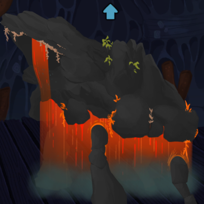

# Lavafall Giant

(requires beta branch) 

Simply replaces the Waterfall Giant's texture with a more obsidian/lava-themed one.

## Installation instructions
1. If there isn't already a `mods` folder located at `C:\Program Files (x86)\Steam\steamapps\common\Slay the Spire 2` (or wherever your file path equivalent is), make one. I'd also highly recommend making a folder within the `mods` folder called `LavafallGiant`, which is where you should put all the related files.
2. Put the latest release of this mod's .pck, .dll, and mod_manifest.json files in that folder.
3. Launch the game. Note that launching the game for the first time created new "modded" save folders, this is intentional and your unmodded saves have not been wiped.
